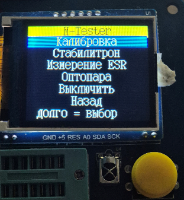
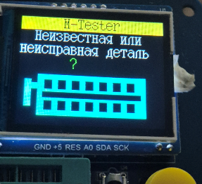
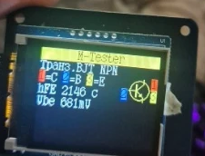
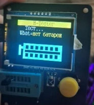
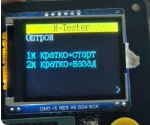
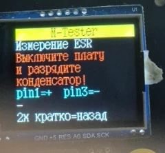
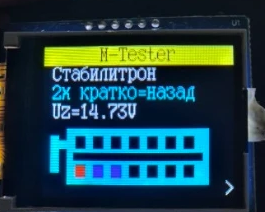
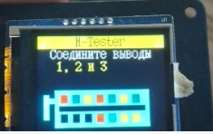

# Compukit TC1 firmware (LGT8F328P) – v19.15

Alternative firmware for the popular **LCR-TC1 / "Multi-function Tester TC1"**
component tester with an **LGT8F328P** microcontroller and a 1.8" **ST7735**
color display (128×160).

It is based on the open source **m-firmware v1.42m by Markus Reschke**
(Component Tester / Transistor Tester) and the LGT8F328P port by
Arnaud Durand. This version adapts it to the real TC1 hardware and gives it an
original-TC1 style user interface in **Dutch, English and Russian**.

> ⚠️ Flashing this firmware replaces the factory firmware. The factory firmware
> of the TC1 can't be read back from the chip, so keep that in mind.

---

## Features

**Component detection** (from the m-firmware)
- Resistors (also two resistors with a common pin, e.g. potentiometers),
  inductors, capacitors with ESR and leakage current
- Diodes / LEDs (forward voltage), multiple diodes
- BJT (NPN/PNP), MOSFET, JFET, IGBT, thyristor (SCR), triac

**TC1 style screens**
- Yellow "M-Tester" title bar, large 10×16 font (8×16 Cyrillic font for Russian)
- Graphic result screens for diode, capacitor, resistor, inductor and two
  resistors: component symbol with colored probe blocks
  (probe 1 = red, 2 = blue, 3 = yellow)
- 3-pin semiconductors: symbol with colored probe blocks and a pin legend
  like `[1]=C [2]=B [3]=E`
- Resistances from 1000 Ω shown with k/M prefix (e.g. `1.01kΩ` instead of `1013Ω`)
- "Testing" screen with ZIF socket drawing and battery voltage + charge in %
- Startup screen with firmware version (10 s, skip with the button),
  large "Bye!" / "Tot ziens!" when switching off

**IR receiver (on the TC1 board)**
- Always listening while a result is shown; a valid **NEC** or **Samsung**
  frame switches to the IR decoder screen (address/command + waveforms)
- Glitch filter and tolerant leader detection
- IR activity lamp in the title bar

**Menu** (long key press)
- Calibration (self adjustment, saved automatically)
- Zener test via the K/A holes of the ZIF socket (28 V boost converter,
  up to about 30 V)
- ESR meter (also in-circuit) with safety warning and discharge check
- Opto coupler test (BJT and triac types)
- Power off
- Back

After leaving the menu a new test starts automatically.

---

## Screenshots

| Main menu (Russian) | Unknown / damaged part | NPN transistor with pin legend |
|---|---|---|
|  |  |  |

| Testing screen | Opto coupler | ESR meter with safety warning |
|---|---|---|
|  |  |  |

| Zener test | Calibration |
|---|---|
|  |  |

Schematic of the LCR-TC1 REV 1A (factory schematic, used to verify the pinout):
[TC1_MFT - REV 1A schema.jpg](TC1_MFT%20-%20REV%201A%20schema.jpg)

---

## Usage and menu

- The button switches the tester on. The version screen is shown for 10 s
  (skip it with the button), then measuring starts.
- Put the part into ZIF holes numbered 1, 2 and 3; the order doesn't matter.
- Short press: new measurement. The tester switches off after about 3 minutes
  without activity.
- **Open the menu:** hold the button for about half a second while a result
  is shown.
- **In the menu:** short press = next item, long press = select
  ("long = select" hint at the bottom).
- **Tools** (Zener test, ESR meter, opto coupler): 1× short = measure/start,
  2× short = back.
- Opto coupler: connect the LED cathode and the transistor emitter together
  (PC817: pin 1 anode → hole 1, pins 2+3 → hole 2, pin 4 collector → hole 3).

---

## Hardware (LCR-TC1, as verified on the board)

| Function | LGT8F328P pin |
|---|---|
| Test pins TP1 / TP2 / TP3 | PC0 / PC1 / PC2 |
| Rl 680 Ω to TP1 / TP2 / TP3 | PB0 / PB2 / PB4 |
| Rh 470 kΩ to TP1 / TP2 / TP3 | PB1 / PB3 / PB5 |
| Zener voltage (53.3 kΩ / 10 kΩ divider, 6.33:1) | PC3 |
| Battery voltage (via 1 MΩ) | PC5 |
| Display ST7735: RES / A0 (D/C) / SCL / SDA | PD0 / PD1 / PD2 / PD4 |
| IR receiver | PD3 (INT1) |
| Power latch | PD6 |
| Test button | PD7 |
| Crystal | 16 MHz |

ZIF socket layout (as printed on the original TC1 screen):

```
top:     1 2 3 1 2 3 2
bottom:  K A A 1 2 3 3      K/A = Zener test only (about 28 V!)
```

---

## LGT8F328P specific changes

The LGT8F328P is not a 100 % ATmega328P clone. Changes compared to the
m-firmware:

- **Clock:** switch to the external 16 MHz crystal at startup
  (PMCR/CLKPR timed writes)
- **EEPROM:** the 1 KB EEPROM is emulated in the last 2 KB of flash
  (ECCR), so the program must stay below **30 720 bytes**
- **ADC:** 12 bit (0–4095) instead of 10 bit; the internal reference is
  **1.024 V** (REFS = 11, calibrated with VCAL1), and MUX channel 0x0E is
  AGND, so the reference can't be measured
- **Cold start:** longer LCD reset and busy-wait delays (Timer2 based sleep
  hangs on a cold start)
- **Startup code:** the watchdog-disable function in `.init3` is `naked`
  for avr-gcc

---

## Files

| File | Language | Font |
|---|---|---|
| `TC1_LGT8F328P_AUTO_MEASURE_v19.15_nl.hex` | Dutch | 10×16 |
| `TC1_LGT8F328P_AUTO_MEASURE_v19.15_en.hex` | English | 10×16 |
| `TC1_LGT8F328P_AUTO_MEASURE_v19.15_ru.hex` | Russian | 8×16 Windows-1251 |

The files are flash-only; the EEPROM (calibration) is part of the flash on
the LGT8F328P.

---

## Flashing

The LGT8F328P is programmed via its SWD interface. It was tested with an
**Arduino Nano used as ISP programmer** (stk500v1 protocol) and avrdude 8.3:

```bash
avrdude -p m328p -c stk500v1 -P COM3 -b 115200 -U flash:w:TC1_LGT8F328P_AUTO_MEASURE_v19.15_en.hex:i
```

Change `COM3` to the port of your programmer.

**After every flash, calibrate once:** flashing also erases the emulated
EEPROM. At the first start the tester shows a checksum message for 5 s and
uses default values. Then: long key press → *Calibration* → connect probes
1, 2 and 3 when asked → remove the connection when asked.

> While the tester is connected to the programmer, the test button doesn't
> work. Disconnect it and run it on the battery for calibration and the menu.

---

## Building

Requirements: `avr-gcc` (tested with 7.3.0 from the Arduino IDE) and GNU make.

```bash
mkdir dep
make TARGET=lgt8f328p TC1_LANG=nl     # nl = Dutch, en = English, ru = Russian
```

Delete the `*.o` files (and `dep/*`) when you switch languages.
The UI strings for all languages are in `tc1_lang.h`, generated by
`gen_lang.ps1` (Russian strings are stored as Windows-1251 octal escapes).

Flash usage of v19.15: Dutch 30 629 bytes, English 30 619 bytes,
Russian 29 639 bytes (limit 30 720 bytes).

---

## Notes and limitations

- **ESR / in-circuit measurements:** the circuit must be switched off and the
  capacitor discharged **before** connecting it. A charged capacitor can
  destroy the microcontroller as soon as it's connected; no software can
  prevent that.
- **Zener test:** with an empty socket it reads the open circuit voltage of
  the boost converter (about 24 V), so Zener diodes above ~24 V can't be
  distinguished from "nothing connected".
- **IR decoder:** only NEC and Samsung frames are decoded.
- Removed to save flash: UJT and Schottky-BJT detection, PWM and square
  wave generator, most extra menu tools.
- The opto coupler screen and the Russian/English versions were checked on
  the display, the opto coupler measurement itself wasn't tested with a
  real part.

---

## Credits and license

- **m-firmware** (Component Tester) – © Markus Reschke,
  based on the work of Markus Frejek and Karl-Heinz Kübbeler
- **LGT8F328P port** – © 2021 Arnaud Durand
- **Russian translation** of the m-firmware – indman@EEVblog
- **TC1 adaptation, UI and LGT fixes (v19.x)** – Compukit

**This is a modified version (Derivative Work) of the m-firmware v1.42m and
its LGT8F328P port. Modified by Compukit, September 2026 (v19.x).**
All original copyright notices in the source files are kept intact.

Licensed under the **EUPL v1.1** (European Union Public Licence), like the
original m-firmware. See `LICENSE` (text); the original `EUPL-v1.1.pdf` is
included in the source zip.

---

## Русский (кратко)

Альтернативная прошивка для тестера компонентов **LCR-TC1** на
**LGT8F328P**, основанная на m-firmware Markus Reschke. Интерфейс в стиле
оригинального TC1 на **русском, английском и голландском** языках,
автоматический ИК-декодер (NEC/Samsung), проверка стабилитронов, измерение
ESR (в том числе на плате), проверка оптопар, напряжение и заряд батареи,
крупное меню.

Прошивка через Arduino Nano в качестве ISP-программатора (см. *Flashing*),
после прошивки **один раз выполнить калибровку** (долгое нажатие кнопки →
Калибровка). При измерении ESR на плате: **питание выключить, конденсатор
разрядить!**

---

## Nederlands (kort)

Alternatieve firmware voor de **LCR-TC1** componententester met
**LGT8F328P**, gebaseerd op de m-firmware van Markus Reschke. Met
TC1-stijl schermen in het **Nederlands, Engels en Russisch**, automatische
IR-decoder, Zenertest, ESR-meting (ook in de schakeling), optocouplertest,
accuspanning met percentage en een groot menu.

Flashen met een Arduino Nano als ISP-programmer (zie *Flashing*), daarna
**één keer kalibreren** (knop lang indrukken → Kalibratie).
Bij ESR-metingen in een schakeling: **print uit en condensator eerst
ontladen!**
